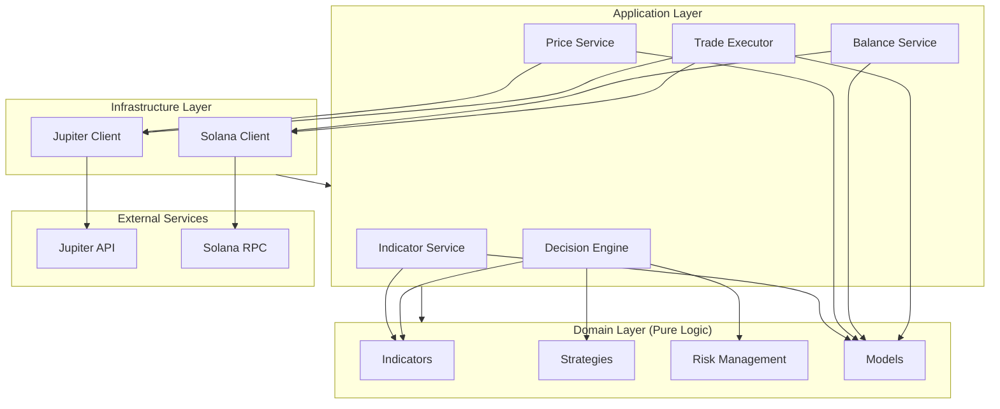
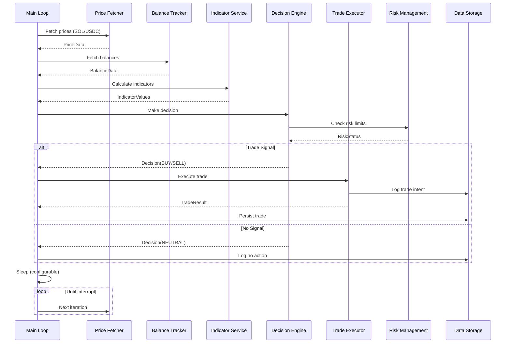
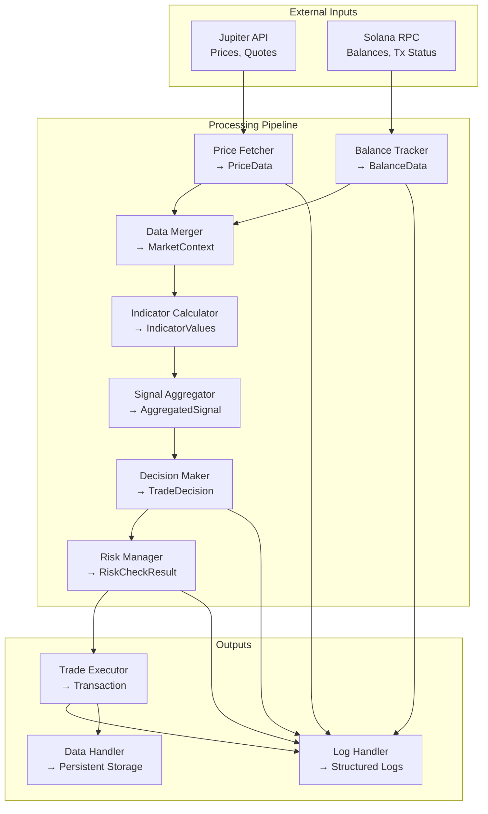

# Architecture Spine - Solana Trading Bot

*Project: Automated Trading Bot for Solana*  
*Paradigm: Modular Monolith with Clean Architecture*  
*Altitude: Initiative (Full System)*

---

## 🎯 Executive Summary

This architecture defines a **modular, testable, and maintainable** personal trading bot for Solana that:
- Uses **Jupiter API V2 HTTP** for price fetching and trade execution
- Implements a **clean architecture** with clear separation of concerns
- Supports **pluggable indicators and strategies**
- **Develops on Devnet**, **deploys to Mainnet** after validation
- Supports **multi-pair trading** simultaneously
- Follows **async-first** design for performance

---

## ✨ Architecture Decisions (AD)

### AD-001: Clean Architecture Paradigm

**Binds:** 
- System organized in **concentric layers** (Domain → Application → Infrastructure)
- **Domain layer** contains pure business logic (indicators, strategies, decisions)
- **Application layer** contains use cases and orchestration
- **Infrastructure layer** contains external integrations (Jupiter, Solana RPC)
- Dependencies point **inward** (Infrastructure → Application → Domain)

**Prevents:**
- Business logic coupled to Jupiter API or Solana RPC specifics
- Circular dependencies between modules
- Difficulty in testing business logic in isolation

**Rule:** 
> All domain entities (Indicator, Strategy, Decision) MUST be framework-agnostic and testable without external services.

---

### AD-002: Modular Monolith Structure

**Binds:**
- Single deployable unit (no microservices)
- Modules organized by **domain concern** (not by technical layer)
- Each module is **independently testable**
- Shared utilities in `core/common/`

**Prevents:**
- Over-engineering with microservices
- Tight coupling between unrelated domains
- Difficulty in understanding the codebase

**Rule:**
> A developer must be able to understand and modify any module without understanding the entire system.

---

### AD-003: Async-First Design

**Binds:**
- All I/O operations are **asynchronous** (HTTP requests, RPC calls)
- Main trading loop uses `asyncio`
- Synchronous code only for pure computation (indicators, decisions)

**Prevents:**
- Blocking operations that freeze the trading loop
- Poor performance due to sequential I/O
- Difficulty in handling concurrent operations

**Rule:**
> Any function that performs I/O MUST be async and use `await`.

---

### AD-004: Dependency Injection Pattern

**Binds:**
- **No global state** - all dependencies passed explicitly
- Services (PriceFetcher, TradeExecutor) injected via constructors
- Configuration passed as immutable dataclasses
- Mock dependencies easily for testing

**Prevents:**
- Hidden dependencies that make testing difficult
- Global state that causes unpredictable behavior
- Tight coupling between components

**Rule:**
> All classes MUST accept their dependencies via constructor parameters, not create them internally.

---

### AD-005: Jupiter API V2 HTTP for Swaps

**Binds:**
- Use **Jupiter API V2** via direct HTTP calls
- Endpoints: `/quote`, `/order`, `/execute`
- No SDK usage (except for Solana transaction signing)

**Prevents:**
- Vendor lock-in to unstable SDKs
- Rate limiting issues from SDK implementation
- Lack of control over request/response format

**Rule:**
> All Jupiter interactions MUST use direct HTTP requests via `httpx.AsyncClient`.

---

### AD-006: Mixed Approach for Solana Interaction

**Binds:**
- Use **`solana-py` + `solders`** for:
  - Keypair management
  - Transaction signing
  - Transaction serialization/deserialization
- Use **direct HTTP** for:
  - Balance queries (`getBalance`)
  - Token account queries (`getTokenAccountsByOwner`)
  - Simple RPC calls

**Prevents:**
- Unnecessary dependencies for simple queries
- Overhead from full SDK when not needed
- Difficulty in debugging RPC calls

**Rule:**
> Use libs (`solana-py`, `solders`) only when they provide significant value over raw HTTP.

---

### AD-007: Event-Driven Trading Loop

**Binds:**
- Main loop runs on a **configurable interval** (default: 1 minute)
- Each iteration:
  1. Fetch prices
  2. Fetch balances
  3. Calculate indicators
  4. Make decision
  5. Execute trade (if decision != NEUTRAL)
  6. Log and persist state
  7. Sleep until next iteration

**Prevents:**
- Busy waiting that consumes resources
- Inconsistent timing between operations
- Difficulty in adjusting trading frequency

**Rule:**
> The trading interval MUST be configurable and respect rate limits.

---

### AD-008: Immutable Data Models

**Binds:**
- All data models (Price, Balance, Trade, etc.) are **immutable**
- Use `dataclasses` or `pydantic` models
- No mutation after creation - create new instances instead

**Prevents:**
- Unexpected side effects from shared mutable state
- Race conditions in concurrent operations
- Difficulty in reasoning about state changes

**Rule:**
> All domain models MUST be immutable. Use `replace()` or copy constructor for updates.

---

### AD-009: Structured Logging

**Binds:**
- Use Python's `logging` module with structured formatters
- Log levels: DEBUG, INFO, WARNING, ERROR
- Include context: timestamp, component, session_id
- JSON format for machine parsing

**Prevents:**
- Difficulty in debugging production issues
- Inconsistent log formats across components
- Missing critical information in logs

**Rule:**
> All modules MUST use the centralized logging configuration from `core/logging.py`.

---

### AD-010: Configuration via YAML + Environment Variables

**Binds:**
- **YAML files** for structured configuration (strategies, indicators)
- **Environment variables** for sensitive data (private keys, API keys)
- Configuration validated at startup using `pydantic`

**Prevents:**
- Hardcoded configuration values
- Sensitive data in version control
- Invalid configuration causing runtime errors

**Rule:**
> Sensitive data MUST come from environment variables, never from config files.

---

### AD-011: Error Handling with Retry

**Binds:**
- **Exponential backoff** for transient errors
- **Circuit breaker** pattern for repeated failures
- **Never crash** - always log and continue or fail gracefully
- Specific handling for known error types (rate limit, timeout, etc.)

**Prevents:**
- Bot crashing on temporary network issues
- Repeated failures overwhelming external services
- Loss of state on errors

**Rule:**
> All external calls MUST implement retry with exponential backoff.

---

### AD-012: Devnet for Development, Mainnet for Production

**Binds:**
- **Default** Devnet RPC URL (`https://api.devnet.solana.com`) for development
- **Configurable** Mainnet RPC URL (`https://api.mainnet-beta.solana.com`) for production
- Network selection via environment variable: `SOLANA_RPC_URL`
- Validation at startup that the configured network is intentional
- Warning if Mainnet is detected (require explicit confirmation)

**Prevents:**
- Accidental trading on Mainnet during development
- Confusion between Devnet and Mainnet configurations
- Unintentional use of wrong network

**Rule:**
> The bot MUST allow both Devnet (development) and Mainnet (production) configurations, with explicit network selection.

---

### AD-013: Multi-Pair Trading Support

**Binds:**
- Support for **N trading pairs** simultaneously
- Each pair has independent indicator calculations and decision making
- Shared portfolio across all pairs
- Configurable via `--pairs` CLI argument or config file
- Example: `--pairs SOL/USDC,SOL/USDT,ETH/SOL`

**Prevents:**
- Limitation to single pair trading
- Missed opportunities on other pairs
- Inefficient capital utilization

**Rule:**
> The bot MUST support trading on multiple pairs in parallel, with each pair processed independently.

---

## 🏗️ System Structure

```
solana-trading-bot/
├── core/                          # Domain & Application Layer
│   ├── __init__.py
│   ├── config.py                 # Configuration loading & validation
│   ├── logging.py                # Structured logging setup
│   ├── exceptions.py             # Custom exceptions
│   │
│   ├── models/                   # Domain Models (Immutable)
│   │   ├── __init__.py
│   │   ├── price.py              # Price, Candle, MarketData
│   │   ├── balance.py            # Balance, Portfolio
│   │   ├── trade.py              # Trade, TradeStatus, TradeType
│   │   ├── indicator.py          # IndicatorValue, Signal
│   │   └── decision.py           # Decision, DecisionType
│   │
│   ├── services/                 # Application Services
│   │   ├── __init__.py
│   │   ├── price_fetcher.py      # Jupiter API price fetching
│   │   ├── balance_tracker.py    # Solana RPC balance tracking
│   │   ├── trade_executor.py     # Jupiter API trade execution
│   │   ├── indicator_service.py # Indicator calculation orchestration
│   │   └── decision_engine.py    # Decision making orchestration
│   │
│   ├── indicators/               # Technical Indicators (Domain)
│   │   ├── __init__.py
│   │   ├── base.py              # BaseIndicator, IndicatorConfig
│   │   ├── rsi.py               # RSI indicator implementation
│   │   ├── macd.py              # MACD indicator implementation
│   │   ├── volume.py            # Volume analysis
│   │   ├── support_resistance.py # Support/Resistance levels
│   │   └── ichimoku.py           # Ichimoku Cloud
│   │
│   ├── strategies/               # Trading Strategies (Domain)
│   │   ├── __init__.py
│   │   ├── base.py              # BaseStrategy, StrategyConfig
│   │   ├── mean_reversion.py    # Mean Reversion strategy
│   │   └── momentum.py          # Momentum strategy
│   │
│   └── risk_management/          # Risk Management (Domain)
│       ├── __init__.py
│       ├── position_sizing.py  # Position size calculation
│       ├── stop_loss.py         # Stop-loss management
│       ├── take_profit.py       # Take-profit management
│       └── limits.py            # Trade frequency, max drawdown
│
├── infrastructure/               # Infrastructure Layer
│   ├── __init__.py
│   ├── jupiter/                 # Jupiter API integration
│   │   ├── __init__.py
│   │   ├── client.py            # Jupiter HTTP client
│   │   ├── quote.py             # Quote endpoint
│   │   ├── order.py             # Order endpoint
│   │   └── execute.py           # Execute endpoint
│   │
│   └── solana/                  # Solana RPC integration
│       ├── __init__.py
│       ├── client.py            # Solana RPC client (mix HTTP + libs)
│       ├── wallet.py            # Wallet management (using solana-py)
│       └── transaction.py       # Transaction signing/serialization
│
├── config/                      # Configuration Files
│   ├── __init__.py
│   ├── settings.py              # Main settings (imported from YAML)
│   ├── tokens.yaml              # Token definitions (mints, decimals)
│   ├── indicators.yaml          # Indicator configurations
│   └── strategies/              # Strategy-specific configs
│       ├── mean_reversion.yaml
│       └── momentum.yaml
│
├── data/                        # Persistent Data
│   ├── trades_history.json      # All executed trades
│   ├── dry_run_trades.json      # Dry-run trade simulations
│   └── logs/                    # Log files
│       ├── trading_YYYYMMDD.log
│       └── errors_YYYYMMDD.log
│
├── scripts/                     # Utility Scripts
│   ├── backtest.py              # Backtesting script
│   ├── validate_config.py       # Configuration validator
│   └── generate_docs.py         # Documentation generator
│
├── tests/                       # Tests
│   ├── unit/                    # Unit tests
│   ├── integration/             # Integration tests
│   └── fixtures/                # Test fixtures
│
├── docs/                        # Documentation
│   ├── architecture.md          # This document (rendered)
│   ├── setup.md                 # Setup guide
│   └── strategies/              # Strategy documentation
│
├── .env.example                 # Environment variables template
├── .env                         # Environment variables (gitignored)
├── requirements.txt             # Python dependencies
├── pyproject.toml               # Project metadata
└── main.py                      # Entry point
```

---

## 🔄 Module Dependencies



**Dependency Rules:**
1. ✅ **Domain → Nothing** (Pure business logic, no external dependencies)
2. ✅ **Application → Domain + Infrastructure** (Orchestrates business logic using external services)
3. ✅ **Infrastructure → External Services** (Implements external integrations)
4. ❌ **No circular dependencies** (Enforced by import structure)
5. ❌ **No Domain → Infrastructure** (Domain must be framework-agnostic)

---

## 📊 Data Flow Architecture

### Main Trading Loop Flow



---

### Component Data Flow



---

## 🏛️ Layered Architecture Details

### Domain Layer (Pure Business Logic)

**Purpose:** Contains the core business rules, independent of any framework or external service.

**Modules:**

```python
# core/models/price.py
from dataclasses import dataclass
from datetime import datetime
from typing import Optional

@dataclass(frozen=True)
class Price:
    """Immutable price data for a token pair."""
    token_in: str          # e.g., "SOL"
    token_out: str         # e.g., "USDC"
    amount_in: float       # Amount of token_in
    amount_out: float      # Expected amount of token_out
    price: float           # price = amount_out / amount_in
    timestamp: datetime
    source: str            # "jupiter", "manual", etc.
    confidence: float      # 0.0 - 1.0

@dataclass(frozen=True)
class Candle:
    """OHLCV data for a specific period."""
    open: float
    high: float
    low: float
    close: float
    volume: float
    timestamp: datetime
    period: str           # "1m", "5m", "1h", etc.
```

```python
# core/indicators/base.py
from abc import ABC, abstractmethod
from dataclasses import dataclass
from typing import List, Generic, TypeVar

T = TypeVar('T')

@dataclass
class IndicatorConfig:
    """Base configuration for all indicators."""
    period: int = 14
    enabled: bool = True
    weight: float = 1.0  # For signal aggregation

class Signal:
    """Trading signal from an indicator."""
    BUY = "BUY"
    SELL = "SELL"
    NEUTRAL = "NEUTRAL"

@dataclass
class IndicatorValue:
    """Result of an indicator calculation."""
    name: str
    value: float
    signal: str  # Signal.BUY, SELL, or NEUTRAL
    timestamp: datetime
    config: IndicatorConfig

class BaseIndicator(ABC, Generic[T]):
    """Abstract base class for all indicators."""
    
    @abstractmethod
    def calculate(self, price_data: List[Price]) -> IndicatorValue:
        """Calculate indicator value from price data."""
        pass
    
    @abstractmethod
    def get_config_class(self) -> type:
        """Return the configuration class for this indicator."""
        pass
```

```python
# core/strategies/base.py
from abc import ABC, abstractmethod
from dataclasses import dataclass
from typing import List, Dict
from core.models import MarketData, Portfolio, Decision

@dataclass
class StrategyConfig:
    """Base configuration for all strategies."""
    name: str
    description: str
    enabled: bool = True
    
    # Risk settings
    max_portfolio_risk: float = 0.01  # 1%
    max_trade_amount: float = 0.5   # SOL
    stop_loss_pct: float = 0.05     # 5%
    take_profit_pct: float = 0.10    # 10%

class BaseStrategy(ABC):
    """Abstract base class for all trading strategies."""
    
    def __init__(self, config: StrategyConfig):
        self.config = config
    
    @abstractmethod
    def analyze(self, market_data: MarketData, portfolio: Portfolio) -> Decision:
        """
        Analyze market data and portfolio, return trading decision.
        
        Args:
            market_data: Current market prices and indicators
            portfolio: Current portfolio state
            
        Returns:
            Decision: BUY, SELL, or HOLD with amount and rationale
        """
        pass
    
    @abstractmethod
    def get_indicators(self) -> List[str]:
        """Return list of indicator names this strategy uses."""
        pass
```

---

### Application Layer (Use Cases & Orchestration)

**Purpose:** Orchestrates the domain logic with external services.

**Key Services:**

```python
# core/services/price_fetcher.py
from typing import Optional
from core.models import Price, TokenPair
from infrastructure.jupiter import JupiterClient

class PriceFetcher:
    """Fetches price data from Jupiter API."""
    
    def __init__(self, jupiter_client: JupiterClient):
        self.jupiter_client = jupiter_client
    
    async def fetch_price(self, pair: TokenPair, amount_in: float) -> Optional[Price]:
        """Fetch current price for a token pair."""
        try:
            quote = await self.jupiter_client.get_quote(
                input_mint=pair.token_in.mint,
                output_mint=pair.token_out.mint,
                amount=int(amount_in * pair.token_in.decimals),
                slippage_bps=100  # 1%
            )
            return Price(
                token_in=pair.token_in.symbol,
                token_out=pair.token_out.symbol,
                amount_in=amount_in,
                amount_out=quote.output_amount / pair.token_out.decimals,
                price=quote.output_amount / quote.input_amount,
                timestamp=datetime.now(),
                source="jupiter",
                confidence=0.95
            )
        except Exception as e:
            # Log and return None - caller handles error
            return None
```

```python
# core/services/trade_executor.py
from typing import Optional
from core.models import Trade, TradeStatus, Decision
from infrastructure.jupiter import JupiterClient
from infrastructure.solana import SolanaClient, Wallet

class TradeExecutor:
    """Executes trades via Jupiter API."""
    
    def __init__(self, jupiter_client: JupiterClient, solana_client: SolanaClient, wallet: Wallet):
        self.jupiter_client = jupiter_client
        self.solana_client = solana_client
        self.wallet = wallet
    
    async def execute_trade(self, decision: Decision) -> Optional[Trade]:
        """Execute a trade based on decision."""
        try:
            # Step 1: Get order from Jupiter
            order = await self.jupiter_client.get_order(
                input_mint=decision.token_in.mint,
                output_mint=decision.token_out.mint,
                amount=int(decision.amount * decision.token_in.decimals),
                slippage_bps=100,
                taker=str(self.wallet.public_key)
            )
            
            # Step 2: Sign transaction
            signed_tx = self._sign_transaction(order.transaction)
            
            # Step 3: Execute via Jupiter
            result = await self.jupiter_client.execute(
                signed_transaction=signed_tx,
                request_id=order.request_id
            )
            
            # Step 4: Verify on Solana
            await self.solana_client.confirm_transaction(result.signature)
            
            return Trade(
                id=result.signature,
                decision=decision,
                status=TradeStatus.SUCCESS,
                input_amount=decision.amount,
                output_amount=result.output_amount,
                price=result.output_amount / decision.amount,
                fees=result.fees,
                timestamp=datetime.now(),
                transaction_signature=result.signature
            )
        except Exception as e:
            return Trade(
                id=None,
                decision=decision,
                status=TradeStatus.FAILED,
                error=str(e),
                timestamp=datetime.now()
            )
    
    def _sign_transaction(self, tx_base64: str) -> str:
        """Sign a base64-encoded transaction."""
        import base64
        from solders.transaction import VersionedTransaction
        
        tx_bytes = base64.b64decode(tx_base64)
        tx = VersionedTransaction.deserialize(tx_bytes)
        tx.sign([self.wallet.keypair])
        return base64.b64encode(tx.serialize()).decode('utf-8')
```

---

### Infrastructure Layer (External Integrations)

**Purpose:** Implements concrete integrations with external services.

**Jupiter Client:**

```python
# infrastructure/jupiter/client.py
import httpx
from typing import Optional, Dict, Any
from core.config import JupiterConfig

class JupiterClient:
    """HTTP client for Jupiter API V2."""
    
    BASE_URL = "https://api.jup.ag/swap/v2"
    
    def __init__(self, config: JupiterConfig):
        self.config = config
        self._client = httpx.AsyncClient(
            base_url=self.BASE_URL,
            timeout=30.0,
            headers=self._get_headers()
        )
    
    def _get_headers(self) -> Dict[str, str]:
        headers = {"Content-Type": "application/json"}
        if self.config.api_key:
            headers["x-api-key"] = self.config.api_key
        return headers
    
    async def get_quote(
        self,
        input_mint: str,
        output_mint: str,
        amount: int,
        slippage_bps: int = 100
    ) -> Dict[str, Any]:
        """Get a price quote from Jupiter."""
        params = {
            "inputMint": input_mint,
            "outputMint": output_mint,
            "amount": str(amount),
            "slippageBps": slippage_bps
        }
        response = await self._client.get("/quote", params=params)
        response.raise_for_status()
        return response.json()
    
    async def get_order(
        self,
        input_mint: str,
        output_mint: str,
        amount: int,
        slippage_bps: int = 100,
        taker: str = None
    ) -> Dict[str, Any]:
        """Get a swap order (includes transaction) from Jupiter."""
        params = {
            "inputMint": input_mint,
            "outputMint": output_mint,
            "amount": str(amount),
            "slippageBps": slippage_bps
        }
        if taker:
            params["taker"] = taker
        
        response = await self._client.get("/order", params=params)
        response.raise_for_status()
        return response.json()
    
    async def execute(
        self,
        signed_transaction: str,
        request_id: str
    ) -> Dict[str, Any]:
        """Execute a signed transaction via Jupiter."""
        data = {
            "signedTransaction": signed_transaction,
            "requestId": request_id
        }
        response = await self._client.post("/execute", json=data)
        response.raise_for_status()
        return response.json()
    
    async def close(self):
        """Close the HTTP client."""
        await self._client.aclose()
```

**Solana Client:**

```python
# infrastructure/solana/client.py
import httpx
from typing import Optional, Dict, Any, List
from solana.rpc.async_api import AsyncClient
from solana.rpc.commitment import Processed
from solders.pubkey import Pubkey
from solders.keypair import Keypair
from core.config import SolanaConfig
from core.models import Balance

class SolanaClient:
    """Mixed HTTP + libs client for Solana."""
    
    def __init__(self, config: SolanaConfig):
        self.config = config
        self._rpc_url = config.rpc_url
        self._async_client = AsyncClient(self._rpc_url, commitment=Processed)
        self._http_client = httpx.AsyncClient(timeout=30.0)
    
    async def get_balance(self, pubkey: str) -> float:
        """Get SOL balance for a wallet."""
        # Using lib for this as it's well-tested
        public_key = Pubkey.from_string(pubkey)
        balance = await self._async_client.get_balance(public_key, commitment=Processed)
        return balance.value / 10**9  # Convert lamports to SOL
    
    async def get_token_balance(self, wallet_pubkey: str, mint: str) -> float:
        """Get token balance for a wallet."""
        # Using HTTP direct for more control
        request_json = {
            "jsonrpc": "2.0",
            "id": 1,
            "method": "getTokenAccountsByOwner",
            "params": [
                wallet_pubkey,
                {"mint": mint},
                {"commitment": "processed"}
            ]
        }
        response = await self._http_client.post(self._rpc_url, json=request_json)
        response.raise_for_status()
        result = response.json()
        
        if not result.get("result", {}).get("value"):
            return 0.0
        
        # Parse token account data (simplified)
        # In production, use proper parsing
        account_info = await self._async_client.get_account_info(
            Pubkey.from_string(result["result"]["value"][0]["pubkey"]),
            commitment=Processed
        )
        if account_info.value and account_info.value.data:
            amount_bytes = account_info.value.data[64:72]
            amount = int.from_bytes(amount_bytes, byteorder='little')
            return amount / 10**6  # Assuming 6 decimals
        return 0.0
    
    async def confirm_transaction(self, signature: str) -> bool:
        """Confirm a transaction."""
        try:
            await self._async_client.confirm_transaction(signature, commitment=Processed)
            return True
        except:
            return False
    
    async def close(self):
        """Close clients."""
        await self._async_client.close()
        await self._http_client.aclose()
```

---

## 🎛️ Configuration System

```python
# core/config.py
from dataclasses import dataclass
from typing import List, Dict, Optional
from pydantic import BaseModel, validator
import yaml
import os

@dataclass(frozen=True)
class JupiterConfig:
    api_url: str = "https://api.jup.ag/swap/v2"
    api_key: Optional[str] = None
    timeout: float = 30.0
    max_retries: int = 3

@dataclass(frozen=True)
class SolanaConfig:
    rpc_url: str = "https://api.devnet.solana.com"
    timeout: float = 30.0
    commitment: str = "processed"

@dataclass(frozen=True)
class TradingConfig:
    interval_minutes: float = 1.0
    dry_run: bool = True
    max_session_duration_hours: Optional[float] = None

@dataclass(frozen=True)
class AppConfig:
    jupiter: JupiterConfig
    solana: SolanaConfig
    trading: TradingConfig
    log_level: str = "INFO"
    data_dir: str = "data"
    
    @classmethod
    def from_env(cls) -> 'AppConfig':
        """Load configuration from environment variables and YAML files."""
        jupiter = JupiterConfig(
            api_key=os.getenv("JUPITER_API_KEY")
        )
        solana = SolanaConfig(
            rpc_url=os.getenv("SOLANA_RPC_URL", "https://api.devnet.solana.com")
        )
        trading = TradingConfig(
            dry_run=os.getenv("DRY_RUN", "true").lower() == "true"
        )
        return cls(jupiter=jupiter, solana=solana, trading=trading)
```

---

## 🔄 Main Application Loop

```python
# main.py
import asyncio
import logging
import signal
from typing import Optional

from core.config import AppConfig
from core.logging import setup_logging
from core.services.price_fetcher import PriceFetcher
from core.services.balance_tracker import BalanceTracker
from core.services.indicator_service import IndicatorService
from core.services.decision_engine import DecisionEngine
from core.services.trade_executor import TradeExecutor
from infrastructure.jupiter import JupiterClient
from infrastructure.solana import SolanaClient
from infrastructure.solana.wallet import Wallet
from core.models import TokenPair, Portfolio

logger = logging.getLogger(__name__)

class TradingBot:
    """Main trading bot application."""
    
    def __init__(self, config: AppConfig):
        self.config = config
        self._running = False
        self._shutdown_requested = False
        
        # Initialize infrastructure
        self.jupiter_client = JupiterClient(config.jupiter)
        self.solana_client = SolanaClient(config.solana)
        self.wallet = Wallet.from_env()  # Loads from WALLET_PRIVATE_KEY
        
        # Initialize services
        self.price_fetcher = PriceFetcher(self.jupiter_client)
        self.balance_tracker = BalanceTracker(self.solana_client, self.wallet)
        self.indicator_service = IndicatorService()
        self.decision_engine = DecisionEngine(self.indicator_service)
        self.trade_executor = TradeExecutor(
            self.jupiter_client, 
            self.solana_client, 
            self.wallet
        )
        
        # Initial portfolio
        self.portfolio = Portfolio(wallet_address=str(self.wallet.public_key))
    
    async def start(self):
        """Start the trading bot."""
        self._running = True
        logger.info("Starting Solana Trading Bot")
        logger.info(f"Network: {self.config.solana.rpc_url}")
        logger.info(f"Wallet: {self.wallet.public_key}")
        logger.info(f"Dry Run: {self.config.trading.dry_run}")
        logger.info(f"Trading Pairs: {len(self.config.trading.pairs)}")
        
        # Validate network configuration
        if "mainnet" in self.config.solana.rpc_url.lower():
            if not self.config.trading.confirm_mainnet:
                raise ValueError("Mainnet detected but not explicitly confirmed. Use --confirm-mainnet to trade on Mainnet.")
            logger.warning("⚠️  MAINNET MODE - Real funds at risk!")
        
        # Load initial balances
        await self._update_portfolio()
        logger.info(f"Initial portfolio: {self.portfolio}")
        
        # Main loop
        while self._running and not self._shutdown_requested:
            try:
                await self._trading_cycle()
                await asyncio.sleep(self.config.trading.interval_minutes * 60)
            except Exception as e:
                logger.error(f"Error in trading cycle: {e}", exc_info=True)
                await asyncio.sleep(5)  # Wait before retry
        
        logger.info("Trading bot stopped")
    
    async def _trading_cycle(self):
        """Execute one trading cycle for all configured pairs."""
        logger.debug("Starting trading cycle")
        
        # Step 1: Update portfolio (shared across all pairs)
        await self._update_portfolio()
        
        # Step 2: Process each trading pair
        for pair_config in self.config.trading.pairs:
            try:
                await self._process_pair(pair_config)
            except Exception as e:
                logger.error(f"Error processing pair {pair_config}: {e}", exc_info=True)
                continue
        
        logger.debug("Trading cycle completed for all pairs")
    
    async def _process_pair(self, pair_config: TokenPair):
        """Process a single trading pair."""
        logger.debug(f"Processing pair: {pair_config}")
        
        # Fetch prices for this pair
        price = await self.price_fetcher.fetch_price(pair_config, amount=1.0)
        if not price:
            logger.warning(f"Failed to fetch price for {pair_config}")
            return
        
        # Calculate indicators for this pair
        indicators = await self.indicator_service.calculate_all(price)
        logger.info(f"[{pair_config}] Indicators: {indicators}")
        
        # Make decision for this pair
        decision = await self.decision_engine.make_decision(
            market_data=MarketData(price=price, indicators=indicators),
            portfolio=self.portfolio
        )
        logger.info(f"[{pair_config}] Decision: {decision}")
        
        # Execute trade if needed
        if decision != Decision.NEUTRAL and not self.config.trading.dry_run:
            trade = await self.trade_executor.execute_trade(decision)
            if trade:
                self.portfolio.apply_trade(trade)
                logger.info(f"[{pair_config}] Trade executed: {trade}")
            else:
                logger.warning(f"[{pair_config}] Trade execution failed")
        elif decision != Decision.NEUTRAL:
            logger.info(f"[{pair_config}] [DRY RUN] Would execute: {decision}")
    
    async def _update_portfolio(self):
        """Update portfolio balances."""
        sol_balance = await self.balance_tracker.get_sol_balance()
        token_balances = await self.balance_tracker.get_token_balances()
        self.portfolio = self.portfolio.update(
            sol_balance=sol_balance,
            token_balances=token_balances
        )
    
    def stop(self):
        """Stop the trading bot."""
        self._running = False
    
    def request_shutdown(self):
        """Request graceful shutdown."""
        self._shutdown_requested = True

async def main():
    """Entry point."""
    config = AppConfig.from_env()
    setup_logging(config.log_level)
    
    bot = TradingBot(config)
    
    # Handle graceful shutdown
    def handle_shutdown(*_):
        bot.request_shutdown()
    
    signal.signal(signal.SIGINT, handle_shutdown)
    signal.signal(signal.SIGTERM, handle_shutdown)
    
    try:
        await bot.start()
    finally:
        # Cleanup
        await bot.jupiter_client.close()
        await bot.solana_client.close()

if __name__ == "__main__":
    asyncio.run(main())
```

---

## 📁 File Structure Details

### Core Domain Models (`core/models/`)

```
core/models/
├── __init__.py          # Exports all models
├── price.py             # Price, Candle, MarketData
├── balance.py           # Balance, Portfolio, Token
├── trade.py             # Trade, TradeStatus, TradeType, Decision
├── indicator.py         # IndicatorValue, Signal, IndicatorConfig
└── strategy.py          # StrategyConfig, StrategyType
```

### Technical Indicators (`core/indicators/`)

Chaque indicateur implémente `BaseIndicator` :

```python
# core/indicators/rsi.py
from typing import List
from dataclasses import dataclass
from core.indicators.base import BaseIndicator, IndicatorConfig, IndicatorValue, Signal
from core.models import Price
from datetime import datetime

@dataclass
class RSIConfig(IndicatorConfig):
    overbought: float = 70.0
    oversold: float = 30.0

class RSI(BaseIndicator[RSIConfig]):
    """Relative Strength Index indicator."""
    
    def __init__(self, config: RSIConfig):
        self.config = config
    
    def calculate(self, price_data: List[Price]) -> IndicatorValue:
        """Calculate RSI from price data."""
        if len(price_data) < self.config.period + 1:
            return IndicatorValue(
                name="RSI",
                value=50.0,  # Neutral by default
                signal=Signal.NEUTRAL,
                timestamp=datetime.now(),
                config=self.config
            )
        
        # Calculate price changes
        changes = []
        for i in range(1, len(price_data)):
            change = price_data[i].price - price_data[i-1].price
            changes.append(change)
        
        # Separate gains and losses
        gains = [c for c in changes if c > 0]
        losses = [-c for c in changes if c < 0]
        
        # Calculate average gain and loss
        if len(gains) > 0:
            avg_gain = sum(gains[-self.config.period:]) / self.config.period
        else:
            avg_gain = 0.0
        
        if len(losses) > 0:
            avg_loss = sum(losses[-self.config.period:]) / self.config.period
        else:
            avg_loss = 0.0
        
        # Calculate RS and RSI
        if avg_loss == 0:
            rsi = 100.0
        else:
            rs = avg_gain / avg_loss
            rsi = 100 - (100 / (1 + rs))
        
        # Determine signal
        if rsi > self.config.overbought:
            signal = Signal.SELL
        elif rsi < self.config.oversold:
            signal = Signal.BUY
        else:
            signal = Signal.NEUTRAL
        
        return IndicatorValue(
            name="RSI",
            value=rsi,
            signal=signal,
            timestamp=datetime.now(),
            config=self.config
        )
    
    def get_config_class(self) -> type:
        return RSIConfig
```

### Trading Strategies (`core/strategies/`)

```python
# core/strategies/mean_reversion.py
from typing import List
from core.strategies.base import BaseStrategy, StrategyConfig
from core.models import MarketData, Portfolio, Decision, TradeType
from core.indicators import RSI
from core.indicators.base import Signal

class MeanReversionStrategy(BaseStrategy):
    """
    Mean Reversion Strategy:
    - Buy when price is low (RSI < oversold)
    - Sell when price is high (RSI > overbought)
    """
    
    def __init__(self, config: StrategyConfig):
        super().__init__(config)
        self.rsi = RSI(config.indicators.rsi)
    
    def analyze(self, market_data: MarketData, portfolio: Portfolio) -> Decision:
        """Analyze market and make decision."""
        # Get RSI value
        rsi_value = market_data.indicators.get("RSI")
        
        if not rsi_value:
            return Decision(
                trade_type=TradeType.HOLD,
                token_in=market_data.price.token_in,
                token_out=market_data.price.token_out,
                amount=0.0,
                rationale="No RSI data available"
            )
        
        # Calculate position size
        amount = self._calculate_position_size(portfolio)
        
        # Make decision based on RSI
        if rsi_value.signal == Signal.BUY:
            return Decision(
                trade_type=TradeType.BUY,
                token_in=market_data.price.token_in,
                token_out=market_data.price.token_out,
                amount=amount,
                rationale=f"RSI oversold ({rsi_value.value:.2f} < {self.rsi.config.oversold})"
            )
        elif rsi_value.signal == Signal.SELL:
            # For mean reversion, sell only if we have position
            if portfolio.get_balance(market_data.price.token_out) > 0:
                return Decision(
                    trade_type=TradeType.SELL,
                    token_in=market_data.price.token_out,
                    token_out=market_data.price.token_in,
                    amount=amount,
                    rationale=f"RSI overbought ({rsi_value.value:.2f} > {self.rsi.config.overbought})"
                )
        
        return Decision(
            trade_type=TradeType.HOLD,
            token_in=market_data.price.token_in,
            token_out=market_data.price.token_out,
            amount=0.0,
            rationale=f"RSI neutral ({rsi_value.value:.2f})"
        )
    
    def get_indicators(self) -> List[str]:
        return ["RSI"]
    
    def _calculate_position_size(self, portfolio: Portfolio) -> float:
        """Calculate position size based on risk settings."""
        total_value = portfolio.total_value()
        max_risk_amount = total_value * self.config.max_portfolio_risk
        return min(max_risk_amount, self.config.max_trade_amount)
```

---

## 🎯 Deferred Decisions

| ID | Decision | Status | Revisit Condition |
|----|----------|--------|------------------|
| D-001 | Backtesting data source | Deferred | When implementing backtesting (M7) |
| D-002 | Telegram/Discord notifications | Deferred | After V1 release |
| D-003 | Support for additional DEXs | Deferred | If Jupiter API limitations become blocking |
| D-004 | Web dashboard interface | Deferred | After CLI is stable |
| D-005 | Advanced risk management (trailing stop, etc.) | Deferred | After basic risk management is validated |

---

## 🔍 Open Questions

| ID | Question | Impact | Status |
|----|---------|--------|--------|
| AQ-001 | Jupiter API rate limits with public key | Medium | Need to test |
| AQ-002 | Token decimal handling for all Devnet tokens | High | Need to verify |
| AQ-003 | Optimal slippage percentage for Devnet | Medium | Need to experiment |

---

## ✅ Verification Checklist

- [x] All AD entries have Binds/Prevents/Rule
- [x] All modules have clear dependencies
- [x] No circular dependencies
- [x] Data flow is clearly defined
- [x] Error handling strategy is documented
- [x] Configuration system is defined
- [x] All external integrations are isolated
- [x] Devnet-only constraint is enforced
- [x] Async-first design is respected
- [ ] Code examples compile (TBD after implementation)

---

## 🏁 Next Steps

1. **Validate this architecture** with stakeholder review
2. **Create epics and user stories** with `bmad-create-epics-and-stories`
3. **Plan sprint** with `bmad-sprint-planning`
4. **Implement core infrastructure** (Jupiter Client, Solana Client)
5. **Implement domain models** (Price, Balance, Trade, etc.)
6. **Implement first indicator** (RSI)
7. **Implement first strategy** (Mean Reversion)
8. **Test end-to-end** with dry run

---

*Document généré par Mistral Vibe - Co-Authored-By: Mistral Vibe <vibe@mistral.ai>*