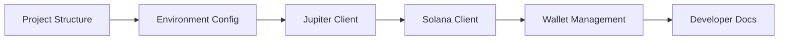
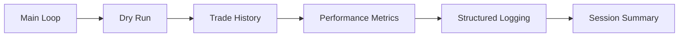
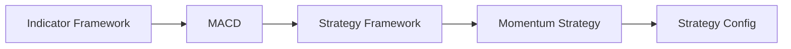
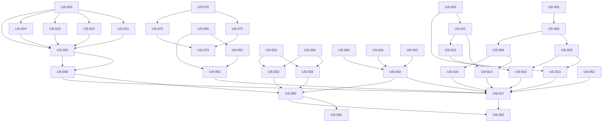

# Epics & User Stories - Solana Trading Bot

*Project: Personal Automated Trading Bot for Solana*  
*Based on: PRD v1.1, Architecture Spine v1.1*  
*Total: 9 Epics, 36 User Stories*  
*Key Changes: Devnet for dev → Mainnet for prod, Multi-pair trading support, Personal project (not open-source), DevOps Infrastructure added*

---

## 📖 Table of Contents

1. [Epic Overview](#-epic-overview)
2. [Epic Details](#-epic-details)
   - [Epic 0: DevOps Infrastructure](#epic-0-devops-infrastructure)
   - [Epic 1: Project Setup & Infrastructure](#epic-1-project-setup--infrastructure)
   - [Epic 2: Core Trading Engine](#epic-2-core-trading-engine)
   - [Epic 3: Technical Indicators](#epic-3-technical-indicators)
   - [Epic 4: Decision Engine & Strategies](#epic-4-decision-engine--strategies)
   - [Epic 5: Risk Management](#epic-5-risk-management)
   - [Epic 6: Monitoring & Analytics](#epic-6-monitoring--analytics)
   - [Epic 7: Testing & Validation](#epic-7-testing--validation)
   - [Epic 8: Documentation & Release](#epic-8-documentation--release)
3. [Story Mapping](#-story-mapping)
4. [Dependencies Matrix](#-dependencies-matrix)
5. [Estimation & Prioritization](#-estimation--prioritization)

---

## 🎯 Epic Overview

| Epic | Title | Priority | Complexity | Stories | MVP | Status |
|------|-------|----------|------------|---------|-----|--------|
| **E0** | DevOps Infrastructure | P0 | Medium | 2 | ✅ | TODO |
| **E1** | Project Setup & Infrastructure | P0 | Medium | 4 | ✅ | TODO |
| **E2** | Core Trading Engine | P0 | High | 8 | ✅ | TODO |
| **E3** | Technical Indicators | P0 | High | 6 | ✅ | TODO |
| **E4** | Decision Engine & Strategies | P0 | High | 5 | ✅ | TODO |
| **E5** | Risk Management | P0 | Medium | 4 | ✅ | TODO |
| **E6** | Monitoring & Analytics | P1 | Medium | 4 | ❌ | TODO |
| **E7** | Testing & Validation | P0 | Medium | 3 | ✅ | TODO |
| **E8** | Documentation & Release | P1 | Low | 4 | ❌ | TODO |

**MVP Scope:** E0-E5 + E7 (31 stories)  
**V1 Scope:** E0-E8 (36 stories)

---

## 📚 Epic Details

---

### 🛠️ Epic 0: DevOps Infrastructure

**Goal:** Set up CI/CD pipeline and Docker container for reproducible development and deployment.

**Priority:** P0 (Blocking for reliable development)

**User Stories:**

#### US-005: CI/CD Pipeline Setup
- **As a** developer
- **I want** an automated CI/CD pipeline
- **So that** I can ensure all tests pass before merging code

**Acceptance Criteria:**
- [ ] GitHub Actions workflow file (`.github/workflows/test.yml`)
- [ ] Triggers on push to `main` and `feature/*` branches
- [ ] Installs all dependencies (`pip install -r requirements.txt`)
- [ ] Runs all unit tests (`pytest tests/`)
- [ ] Runs integration tests
- [ ] Generates coverage report
- [ ] Fails if any test fails
- [ ] Green badge on README when tests pass

**Tasks:**
- [ ] Create `.github/workflows/` directory
- [ ] Create `test.yml` workflow file
- [ ] Configure test matrix (Python 3.10, 3.11)
- [ ] Set up coverage reporting (optional: codecov)
- [ ] Add badge to README

**Dependencies:** US-001, US-002  
**Estimate:** 2h  
**Priority:** P0  
**MVP:** ✅

---

#### US-006: Docker Setup
- **As a** developer
- **I want** Docker support
- **So that** I can run the bot in a reproducible environment

**Acceptance Criteria:**
- [ ] `Dockerfile` in project root
- [ ] Multi-stage build (slim base image)
- [ ] All dependencies installed in container
- [ ] Environment variables for configuration
- [ ] Default to Devnet in container
- [ ] `docker-compose.yml` for development (optional)
- [ ] `.dockerignore` file
- [ ] Bot runs successfully with `docker run`

**Tasks:**
- [ ] Create `Dockerfile`
- [ ] Create `.dockerignore`
- [ ] Create `docker-compose.yml` (optional)
- [ ] Test Docker build
- [ ] Document Docker usage in README

**Dependencies:** US-001, US-002  
**Estimate:** 2h  
**Priority:** P0  
**MVP:** ✅

---

### 🏗️ Epic 1: Project Setup & Infrastructure

**Goal:** Establish the project foundation with proper structure, dependencies, and CI/CD.

**Priority:** P0 (Blocking for all other epics)

**User Stories:**

#### US-001: Project Structure Setup
- **As a** developer
- **I want** the project to have the correct directory structure
- **So that** I can easily navigate and extend the codebase

**Acceptance Criteria:**
- [ ] Directory structure matches architecture document
- [ ] All directories have `__init__.py` files
- [ ] `src/` layout with proper Python packaging
- [ ] `.gitignore` excludes sensitive files (`.env`, `*.pyc`, etc.)
- [ ] `requirements.txt` with all dependencies
- [ ] `pyproject.toml` with project metadata

**Tasks:**
- [ ] Create directory structure
- [ ] Create `__init__.py` files
- [ ] Create `.gitignore`
- [ ] Create `requirements.txt`
- [ ] Create `pyproject.toml`
- [ ] Verify Python package structure

**Dependencies:** None  
**Estimate:** 2h  
**Priority:** P0  
**MVP:** ✅

---

#### US-002: Environment Configuration
- **As a** developer
- **I want** to configure the bot via environment variables and YAML files
- **So that** I can easily switch between different configurations

**Acceptance Criteria:**
- [ ] `.env.example` with all required variables
- [ ] `.env` (gitignored) for local development
- [ ] Configuration loading from environment variables
- [ ] YAML configuration files for strategies and indicators
- [ ] Configuration validation using Pydantic
- [ ] Devnet-only validation at startup

**Tasks:**
- [ ] Create `.env.example`
- [ ] Create configuration dataclasses
- [ ] Implement YAML loading
- [ ] Implement Pydantic validation
- [ ] Add Devnet validation
- [ ] Create `config/` directory with default configs

**Dependencies:** US-001  
**Estimate:** 4h  
**Priority:** P0  
**MVP:** ✅

---

#### US-003: Infrastructure Layer - Jupiter Client
- **As a** developer
- **I want** a robust Jupiter API V2 HTTP client
- **So that** I can reliably fetch prices and execute trades

**Acceptance Criteria:**
- [ ] `JupiterClient` class in `infrastructure/jupiter/client.py`
- [ ] Async HTTP client using `httpx`
- [ ] Implemented endpoints: `/quote`, `/order`, `/execute`
- [ ] Proper error handling (rate limiting, timeout, invalid response)
- [ ] Retry with exponential backoff
- [ ] API key support for higher rate limits
- [ ] Unit tests with mock responses

**Tasks:**
- [ ] Create JupiterClient class
- [ ] Implement `/quote` endpoint
- [ ] Implement `/order` endpoint
- [ ] Implement `/execute` endpoint
- [ ] Add error handling
- [ ] Add retry logic
- [ ] Add API key support
- [ ] Write unit tests

**Dependencies:** US-001, US-002  
**Estimate:** 6h  
**Priority:** P0  
**MVP:** ✅

---

#### US-004: Infrastructure Layer - Solana Client
- **As a** developer
- **I want** a Solana RPC client with mixed approach
- **So that** I can query balances and manage transactions efficiently

**Acceptance Criteria:**
- [ ] `SolanaClient` class in `infrastructure/solana/client.py`
- [ ] Use `solana-py` + `solders` for transaction signing
- [ ] Use direct HTTP for balance and token account queries
- [ ] Implemented methods: `get_balance`, `get_token_balance`, `confirm_transaction`
- [ ] Proper error handling
- [ ] Unit tests with mock RPC responses

**Tasks:**
- [ ] Create SolanaClient class
- [ ] Implement `get_balance` (using lib)
- [ ] Implement `get_token_balance` (using HTTP)
- [ ] Implement `confirm_transaction`
- [ ] Add error handling
- [ ] Write unit tests

**Dependencies:** US-001, US-002, US-003  
**Estimate:** 6h  
**Priority:** P0  
**MVP:** ✅

---

---

### ⚙️ Epic 2: Core Trading Engine

**Goal:** Implement the core components that power the trading bot.

**Priority:** P0 (Core functionality)

**User Stories:**

#### US-010: Domain Models - Price & Market Data
- **As a** developer
- **I want** immutable domain models for price and market data
- **So that** I can safely pass data between components

**Acceptance Criteria:**
- [ ] `Price` dataclass (frozen=True)
- [ ] `Candle` dataclass for OHLCV data
- [ ] `MarketData` dataclass combining price and indicators
- [ ] `Token` dataclass with symbol, mint, decimals
- [ ] `TokenPair` dataclass for trading pairs
- [ ] Proper type hints and docstrings
- [ ] Serialization/deserialization support

**Tasks:**
- [ ] Create `core/models/price.py`
- [ ] Implement Price dataclass
- [ ] Implement Candle dataclass
- [ ] Implement MarketData dataclass
- [ ] Implement Token dataclass
- [ ] Implement TokenPair dataclass
- [ ] Add type hints and docstrings

**Dependencies:** US-001, US-002  
**Estimate:** 4h  
**Priority:** P0  
**MVP:** ✅

---

#### US-011: Domain Models - Balance & Portfolio
- **As a** developer
- **I want** immutable models for balances and portfolio
- **So that** I can track the bot's financial state accurately

**Acceptance Criteria:**
- [ ] `Balance` dataclass for token balances
- [ ] `Portfolio` dataclass with SOL and token balances
- [ ] Methods: `total_value()`, `get_balance(token)`, `apply_trade(trade)`
- [ ] Immutable updates (return new instance)
- [ ] Proper type hints and docstrings

**Tasks:**
- [ ] Create `core/models/balance.py`
- [ ] Implement Balance dataclass
- [ ] Implement Portfolio dataclass
- [ ] Implement helper methods
- [ ] Add type hints and docstrings

**Dependencies:** US-001, US-002, US-010  
**Estimate:** 4h  
**Priority:** P0  
**MVP:** ✅

---

#### US-012: Domain Models - Trade & Decision
- **As a** developer
- **I want** models for trades and trading decisions
- **So that** I can track and execute trading actions

**Acceptance Criteria:**
- [ ] `Trade` dataclass with all trade details
- [ ] `TradeStatus` enum (PENDING, SUCCESS, FAILED)
- [ ] `TradeType` enum (BUY, SELL, SWAP)
- [ ] `Decision` dataclass for trading decisions
- [ ] `Signal` enum (BUY, SELL, NEUTRAL)
- [ ] Proper type hints and docstrings

**Tasks:**
- [ ] Create `core/models/trade.py`
- [ ] Implement Trade dataclass
- [ ] Implement TradeStatus enum
- [ ] Implement TradeType enum
- [ ] Implement Decision dataclass
- [ ] Implement Signal enum
- [ ] Add type hints and docstrings

**Dependencies:** US-001, US-002, US-010, US-011  
**Estimate:** 3h  
**Priority:** P0  
**MVP:** ✅

---

#### US-013: Price Fetcher Service
- **As a** trading bot
- **I want** to fetch current prices from Jupiter API
- **So that** I can make informed trading decisions

**Acceptance Criteria:**
- [ ] `PriceFetcher` class in `core/services/price_fetcher.py`
- [ ] Method: `fetch_price(pair: TokenPair, amount: float) -> Optional[Price]`
- [ ] Dependency injection: accepts `JupiterClient`
- [ ] Proper error handling and logging
- [ ] Cache prices for X seconds to avoid rate limiting
- [ ] Unit tests with mock JupiterClient

**Tasks:**
- [ ] Create PriceFetcher class
- [ ] Implement fetch_price method
- [ ] Add dependency injection
- [ ] Add error handling
- [ ] Add price caching
- [ ] Write unit tests

**Dependencies:** US-003, US-010  
**Estimate:** 4h  
**Priority:** P0  
**MVP:** ✅

---

#### US-014: Balance Tracker Service
- **As a** trading bot
- **I want** to track my SOL and token balances
- **So that** I can manage my portfolio effectively

**Acceptance Criteria:**
- [ ] `BalanceTracker` class in `core/services/balance_tracker.py`
- [ ] Methods: `get_sol_balance()`, `get_token_balance(mint)`, `get_all_balances()`
- [ ] Dependency injection: accepts `SolanaClient` and `Wallet`
- [ ] Proper error handling and logging
- [ ] Unit tests with mock SolanaClient

**Tasks:**
- [ ] Create BalanceTracker class
- [ ] Implement get_sol_balance
- [ ] Implement get_token_balance
- [ ] Implement get_all_balances
- [ ] Add dependency injection
- [ ] Add error handling
- [ ] Write unit tests

**Dependencies:** US-004, US-011  
**Estimate:** 4h  
**Priority:** P0  
**MVP:** ✅

---

#### US-015: Trade Executor Service
- **As a** trading bot
- **I want** to execute trades via Jupiter API
- **So that** I can automatically buy and sell tokens

**Acceptance Criteria:**
- [ ] `TradeExecutor` class in `core/services/trade_executor.py`
- [ ] Method: `execute_trade(decision: Decision) -> Optional[Trade]`
- [ ] Uses Jupiter Order & Execute workflow
- [ ] Proper transaction signing with wallet
- [ ] Verification of transaction confirmation
- [ ] Proper error handling (insufficient funds, slippage, timeout)
- [ ] Dry-run mode support
- [ ] Unit tests with mock dependencies

**Tasks:**
- [ ] Create TradeExecutor class
- [ ] Implement execute_trade method
- [ ] Add Jupiter Order & Execute integration
- [ ] Add transaction signing
- [ ] Add confirmation verification
- [ ] Add error handling
- [ ] Add dry-run mode
- [ ] Write unit tests

**Dependencies:** US-003, US-004, US-012  
**Estimate:** 8h  
**Priority:** P0  
**MVP:** ✅

---

#### US-016: Wallet Management
- **As a** developer
- **I want** secure wallet management
- **So that** I can safely sign transactions

**Acceptance Criteria:**
- [ ] `Wallet` class in `infrastructure/solana/wallet.py`
- [ ] Load from private key or .env file
- [ ] Secure handling of private keys (never logged)
- [ ] Method: `sign_transaction(tx_bytes) -> signed_tx_bytes`
- [ ] Support for default test wallet
- [ ] Unit tests for signing

**Tasks:**
- [ ] Create Wallet class
- [ ] Implement private key loading
- [ ] Implement transaction signing
- [ ] Add security checks
- [ ] Write unit tests

**Dependencies:** US-002, US-004  
**Estimate:** 4h  
**Priority:** P0  
**MVP:** ✅

---

#### US-017: Main Trading Loop with Multi-Pair Support
- **As a** trading bot
- **I want** a main loop that orchestrates all components for multiple trading pairs
- **So that** I can automatically execute trading cycles on N pairs simultaneously

**Acceptance Criteria:**
- [ ] `TradingBot` class in `main.py`
- [ ] Configurable trading interval (default: 1 minute)
- [ ] **Support for N trading pairs** via `--pairs` CLI argument or config file
- [ ] Each cycle processes ALL configured pairs sequentially
- [ ] Each pair has independent: price fetching, indicator calculation, decision making
- [ ] Shared portfolio across all pairs
- [ ] Graceful shutdown on SIGINT/SIGTERM
- [ ] Proper logging at each step (includes pair identifier)
- [ ] Dry-run mode support
- [ ] Network validation at startup (Devnet default, Mainnet with explicit confirmation)

**Tasks:**
- [ ] Create TradingBot class
- [ ] Implement main loop for multiple pairs
- [ ] Add pair processing loop (`_process_pair` method)
- [ ] Add multi-pair configuration support
- [ ] Add graceful shutdown
- [ ] Add structured logging with pair context
- [ ] Add dry-run mode
- [ ] Add network validation (Devnet/Mainnet)
- [ ] Write integration test

**Dependencies:** US-013, US-014, US-015, US-016  
**Estimate:** 8h  
**Priority:** P0  
**MVP:** ✅

---

---

### 📈 Epic 3: Technical Indicators

**Goal:** Implement technical indicators for market analysis.

**Priority:** P0 (Core functionality for decision making)

**User Stories:**

#### US-020: Indicator Framework
- **As a** developer
- **I want** a base framework for all technical indicators
- **So that** I can easily add new indicators

**Acceptance Criteria:**
- [ ] `BaseIndicator` abstract class in `core/indicators/base.py`
- [ ] Generic type support for indicator configurations
- [ ] Abstract methods: `calculate(price_data) -> IndicatorValue`, `get_config_class()`
- [ ] `IndicatorConfig` base dataclass
- [ ] `IndicatorValue` dataclass
- [ ] `Signal` enum (BUY, SELL, NEUTRAL)
- [ ] Unit tests for base framework

**Tasks:**
- [ ] Create base indicator classes
- [ ] Define abstract methods
- [ ] Implement base dataclasses
- [ ] Write unit tests

**Dependencies:** US-001, US-002, US-010  
**Estimate:** 4h  
**Priority:** P0  
**MVP:** ✅

---

#### US-021: RSI Indicator
- **As a** trading bot
- **I want** to calculate the Relative Strength Index
- **So that** I can detect overbought and oversold conditions

**Acceptance Criteria:**
- [ ] `RSI` class extending `BaseIndicator`
- [ ] `RSIConfig` dataclass with period, overbought, oversold
- [ ] Method: `calculate(price_data: List[Price]) -> IndicatorValue`
- [ ] Proper RSI calculation formula
- [ ] Signal generation (BUY if < oversold, SELL if > overbought)
- [ ] Unit tests with known RSI values

**Tasks:**
- [ ] Create RSIConfig
- [ ] Implement RSI class
- [ ] Implement calculate method
- [ ] Add signal generation
- [ ] Write unit tests

**Dependencies:** US-001, US-020, US-010  
**Estimate:** 6h  
**Priority:** P0  
**MVP:** ✅

---

#### US-022: MACD Indicator
- **As a** trading bot
- **I want** to calculate the Moving Average Convergence Divergence
- **So that** I can identify trend changes

**Acceptance Criteria:**
- [ ] `MACD` class extending `BaseIndicator`
- [ ] `MACDConfig` dataclass with fast_ema, slow_ema, signal
- [ ] Method: `calculate(price_data: List[Price]) -> IndicatorValue`
- [ ] Proper MACD calculation (MACD line, Signal line, Histogram)
- [ ] Signal generation based on crossovers
- [ ] Unit tests with known MACD values

**Tasks:**
- [ ] Create MACDConfig
- [ ] Implement MACD class
- [ ] Implement calculate method
- [ ] Add signal generation
- [ ] Write unit tests

**Dependencies:** US-001, US-020, US-010  
**Estimate:** 6h  
**Priority:** P0  
**MVP:** ✅

---

#### US-023: Volume Indicator
- **As a** trading bot
- **I want** to analyze trading volume
- **So that** I can confirm price movements

**Acceptance Criteria:**
- [ ] `Volume` class extending `BaseIndicator`
- [ ] `VolumeConfig` dataclass with period
- [ ] Method: `calculate(price_data: List[Price]) -> IndicatorValue`
- [ ] Calculate average volume over period
- [ ] Detect volume spikes (breakout confirmation)
- [ ] Signal generation (BUY/SELL based on volume patterns)
- [ ] Unit tests

**Tasks:**
- [ ] Create VolumeConfig
- [ ] Implement Volume class
- [ ] Implement calculate method
- [ ] Add signal generation
- [ ] Write unit tests

**Dependencies:** US-001, US-020, US-010  
**Estimate:** 4h  
**Priority:** P1  
**MVP:** ❌

---

#### US-024: Support & Resistance Indicator
- **As a** trading bot
- **I want** to identify support and resistance levels
- **So that** I can trade at key price levels

**Acceptance Criteria:**
- [ ] `SupportResistance` class extending `BaseIndicator`
- [ ] `SupportResistanceConfig` dataclass with method, period
- [ ] Method: `calculate(price_data: List[Price]) -> IndicatorValue`
- [ ] Identification of support/resistance levels
- [ ] Methods: Pivot Points, Fractals, or High/Low
- [ ] Alert when price approaches a level
- [ ] Unit tests

**Tasks:**
- [ ] Create SupportResistanceConfig
- [ ] Implement SupportResistance class
- [ ] Implement calculate method
- [ ] Add level identification
- [ ] Add alert generation
- [ ] Write unit tests

**Dependencies:** US-001, US-020, US-010  
**Estimate:** 6h  
**Priority:** P1  
**MVP:** ❌

---

#### US-025: Indicator Service
- **As a** trading bot
- **I want** a service to orchestrate indicator calculations
- **So that** I can calculate all indicators for a price

**Acceptance Criteria:**
- [ ] `IndicatorService` class in `core/services/indicator_service.py`
- [ ] Method: `calculate_all(price: Price) -> Dict[str, IndicatorValue]`
- [ ] Method: `calculate_one(indicator_name: str, price_data: List[Price]) -> IndicatorValue`
- [ ] Dynamic indicator registration
- [ ] Configuration management for all indicators
- [ ] Unit tests

**Tasks:**
- [ ] Create IndicatorService class
- [ ] Implement calculate_all method
- [ ] Implement calculate_one method
- [ ] Add dynamic registration
- [ ] Add configuration management
- [ ] Write unit tests

**Dependencies:** US-020, US-021, US-022, US-023, US-024  
**Estimate:** 4h  
**Priority:** P0  
**MVP:** ✅

---

---

### 🤖 Epic 4: Decision Engine & Strategies

**Goal:** Implement the decision-making logic and trading strategies.

**Priority:** P0 (Core functionality)

**User Stories:**

#### US-030: Decision Engine
- **As a** trading bot
- **I want** a decision engine that aggregates indicator signals
- **So that** I can make automated trading decisions

**Acceptance Criteria:**
- [ ] `DecisionEngine` class in `core/services/decision_engine.py`
- [ ] Method: `make_decision(market_data: MarketData, portfolio: Portfolio) -> Decision`
- [ ] Signal aggregation from multiple indicators
- [ ] Configurable weights for each indicator
- [ ] Configurable thresholds for BUY/SELL signals
- [ ] Risk check integration (calls Risk Manager)
- [ ] Unit tests

**Tasks:**
- [ ] Create DecisionEngine class
- [ ] Implement signal aggregation
- [ ] Add weight configuration
- [ ] Add threshold configuration
- [ ] Add risk check integration
- [ ] Write unit tests

**Dependencies:** US-013, US-014, US-015, US-025  
**Estimate:** 6h  
**Priority:** P0  
**MVP:** ✅

---

#### US-031: Strategy Framework
- **As a** developer
- **I want** a base framework for trading strategies
- **So that** I can easily implement new strategies

**Acceptance Criteria:**
- [ ] `BaseStrategy` abstract class in `core/strategies/base.py`
- [ ] `StrategyConfig` dataclass with risk settings
- [ ] Abstract methods: `analyze(market_data, portfolio) -> Decision`, `get_indicators() -> List[str]`
- [ ] Strategy registry for dynamic loading
- [ ] Unit tests for base framework

**Tasks:**
- [ ] Create BaseStrategy class
- [ ] Create StrategyConfig
- [ ] Define abstract methods
- [ ] Implement strategy registry
- [ ] Write unit tests

**Dependencies:** US-001, US-002, US-010, US-011, US-012  
**Estimate:** 4h  
**Priority:** P0  
**MVP:** ✅

---

#### US-032: Mean Reversion Strategy
- **As a** trading bot
- **I want** a mean reversion strategy
- **So that** I can profit from price returning to its average

**Acceptance Criteria:**
- [ ] `MeanReversionStrategy` class extending `BaseStrategy`
- [ ] Uses RSI indicator primarily
- [ ] Buy when RSI < oversold (default: 30)
- [ ] Sell when RSI > overbought (default: 70)
- [ ] Configurable risk settings (max portfolio risk, max trade amount)
- [ ] Unit tests with various market conditions

**Tasks:**
- [ ] Create MeanReversionStrategy class
- [ ] Implement analyze method
- [ ] Add RSI-based logic
- [ ] Add risk settings
- [ ] Write unit tests

**Dependencies:** US-021, US-031  
**Estimate:** 6h  
**Priority:** P0  
**MVP:** ✅

---

#### US-033: Momentum Strategy
- **As a** trading bot
- **I want** a momentum strategy
- **So that** I can profit from trend continuation

**Acceptance Criteria:**
- [ ] `MomentumStrategy` class extending `BaseStrategy`
- [ ] Uses MACD indicator primarily
- [ ] Buy when MACD > Signal line
- [ ] Sell when MACD < Signal line
- [ ] Optional: Moving Average confirmation
- [ ] Configurable risk settings
- [ ] Unit tests with various market conditions

**Tasks:**
- [ ] Create MomentumStrategy class
- [ ] Implement analyze method
- [ ] Add MACD-based logic
- [ ] Add optional MA confirmation
- [ ] Add risk settings
- [ ] Write unit tests

**Dependencies:** US-022, US-031  
**Estimate:** 6h  
**Priority:** P0  
**MVP:** ✅

---

#### US-034: Strategy Configuration
- **As a** user
- **I want** to configure strategies via YAML files
- **So that** I can customize strategy parameters without code changes

**Acceptance Criteria:**
- [ ] YAML configuration files for each strategy
- [ ] `mean_reversion.yaml` with RSI settings, risk settings
- [ ] `momentum.yaml` with MACD settings, risk settings
- [ ] Configuration loaded at strategy initialization
- [ ] Validation of configuration values
- [ ] Hot-reload support (optional for V2)

**Tasks:**
- [ ] Create mean_reversion.yaml
- [ ] Create momentum.yaml
- [ ] Implement config loading
- [ ] Add validation
- [ ] Document configuration options

**Dependencies:** US-002, US-031, US-032, US-033  
**Estimate:** 3h  
**Priority:** P0  
**MVP:** ✅

---

---

### 🛡️ Epic 5: Risk Management

**Goal:** Implement risk management features to protect the portfolio.

**Priority:** P0 (Critical for safe trading)

**User Stories:**

#### US-040: Position Sizing
- **As a** trading bot
- **I want** to calculate position sizes based on risk
- **So that** I don't risk more than I can afford to lose

**Acceptance Criteria:**
- [ ] `PositionSizing` class in `core/risk_management/position_sizing.py`
- [ ] Method: `calculate_amount(portfolio: Portfolio, risk_pct: float) -> float`
- [ ] Consider portfolio total value
- [ ] Respect max_trade_amount limit
- [ ] Configurable risk percentage (default: 1%)
- [ ] Unit tests with various portfolio sizes

**Tasks:**
- [ ] Create PositionSizing class
- [ ] Implement calculate_amount method
- [ ] Add risk percentage configuration
- [ ] Add max trade amount limit
- [ ] Write unit tests

**Dependencies:** US-001, US-011  
**Estimate:** 4h  
**Priority:** P0  
**MVP:** ✅

---

#### US-041: Stop Loss Management
- **As a** trading bot
- **I want** automatic stop-loss protection
- **So that** I can limit losses on each trade

**Acceptance Criteria:**
- [ ] `StopLoss` class in `core/risk_management/stop_loss.py`
- [ ] Method: `check(portfolio: Portfolio, current_price: float, entry_price: float) -> bool`
- [ ] Configurable stop-loss percentage (default: 5%)
- [ ] Integration with TradeExecutor
- [ ] Logging of stop-loss events
- [ ] Unit tests

**Tasks:**
- [ ] Create StopLoss class
- [ ] Implement check method
- [ ] Add percentage configuration
- [ ] Add TradeExecutor integration
- [ ] Add logging
- [ ] Write unit tests

**Dependencies:** US-012, US-015, US-040  
**Estimate:** 4h  
**Priority:** P0  
**MVP:** ✅

---

#### US-042: Take Profit Management
- **As a** trading bot
- **I want** automatic take-profit
- **So that** I can secure profits on winning trades

**Acceptance Criteria:**
- [ ] `TakeProfit` class in `core/risk_management/take_profit.py`
- [ ] Method: `check(portfolio: Portfolio, current_price: float, entry_price: float) -> bool`
- [ ] Configurable take-profit percentage (default: 10%)
- [ ] Integration with TradeExecutor
- [ ] Logging of take-profit events
- [ ] Unit tests

**Tasks:**
- [ ] Create TakeProfit class
- [ ] Implement check method
- [ ] Add percentage configuration
- [ ] Add TradeExecutor integration
- [ ] Add logging
- [ ] Write unit tests

**Dependencies:** US-012, US-015, US-040  
**Estimate:** 4h  
**Priority:** P0  
**MVP:** ✅

---

#### US-043: Risk Management Integration
- **As a** trading bot
- **I want** all risk checks integrated into the decision process
- **So that** no trade violates risk limits

**Acceptance Criteria:**
- [ ] RiskManager class in `core/risk_management/__init__.py`
- [ ] Method: `check_decision(decision: Decision, portfolio: Portfolio) -> RiskCheckResult`
- [ ] Integrates PositionSizing, StopLoss, TakeProfit
- [ ] Aggregated risk check result (PASS/FAIL with reasons)
- [ ] Integration with DecisionEngine
- [ ] Unit tests

**Tasks:**
- [ ] Create RiskManager class
- [ ] Implement check_decision method
- [ ] Integrate all risk components
- [ ] Add DecisionEngine integration
- [ ] Write unit tests

**Dependencies:** US-040, US-041, US-042, US-030  
**Estimate:** 4h  
**Priority:** P0  
**MVP:** ✅

---

---

### 📊 Epic 6: Monitoring & Analytics

**Goal:** Implement monitoring and analytics for performance tracking.

**Priority:** P1 (Nice to have for V1, not blocking)

**User Stories:**

#### US-050: Trade History Logging
- **As a** user
- **I want** a complete history of all trades
- **So that** I can analyze my trading performance

**Acceptance Criteria:**
- [ ] Automatic logging of all trades to `trades_history.json`
- [ ] Trade data includes: timestamp, type, tokens, amounts, prices, signature, status
- [ ] Structured JSON format
- [ ] Append-only (no overwriting)
- [ ] Support for filtering by date, status, etc.
- [ ] Unit tests

**Tasks:**
- [ ] Create TradeHistory class
- [ ] Implement logging to JSON file
- [ ] Implement trade data structure
- [ ] Add filtering support
- [ ] Write unit tests

**Dependencies:** US-012, US-017  
**Estimate:** 4h  
**Priority:** P1  
**MVP:** ❌

---

#### US-051: Performance Metrics
- **As a** user
- **I want** performance metrics calculated automatically
- **So that** I can evaluate my trading strategy

**Acceptance Criteria:**
- [ ] Metrics calculated: PnL, Win Rate, Avg Profit/Loss, Max Drawdown, Sharpe Ratio
- [ ] `MetricsCalculator` class in `core/services/metrics.py`
- [ ] Method: `calculate(trades: List[Trade]) -> Metrics`
- [ ] Metrics dataclass with all values
- [ ] Session summary generated at shutdown
- [ ] Unit tests

**Tasks:**
- [ ] Create Metrics dataclass
- [ ] Create MetricsCalculator class
- [ ] Implement all metric calculations
- [ ] Add session summary generation
- [ ] Write unit tests

**Dependencies:** US-050  
**Estimate:** 6h  
**Priority:** P1  
**MVP:** ❌

---

#### US-052: Structured Logging
- **As a** developer
- **I want** comprehensive structured logging
- **So that** I can debug and monitor the bot

**Acceptance Criteria:**
- [ ] `setup_logging()` function in `core/logging.py`
- [ ] JSON formatter for machine parsing
- [ ] Context in logs: timestamp, level, component, session_id
- [ ] Log levels: DEBUG, INFO, WARNING, ERROR
- [ ] Separate files for trading and errors
- [ ] Rotation of log files

**Tasks:**
- [ ] Create logging.py
- [ ] Implement JSON formatter
- [ ] Add context to logs
- [ ] Configure log rotation
- [ ] Integrate with all modules

**Dependencies:** US-001  
**Estimate:** 4h  
**Priority:** P1  
**MVP:** ❌

---

#### US-053: Session Summary Report
- **As a** user
- **I want** a summary report at the end of each session
- **So that** I can quickly see how the bot performed

**Acceptance Criteria:**
- [ ] Summary generated at graceful shutdown
- [ ] Includes: session duration, trades executed, PnL, best/worst trade
- [ ] Printed to console
- [ ] Saved to file (`session_summary_YYYYMMDD.md`)
- [ ] Email/notification support (optional for V2)

**Tasks:**
- [ ] Create SummaryGenerator class
- [ ] Implement summary data collection
- [ ] Add console output
- [ ] Add file output
- [ ] Integrate with shutdown

**Dependencies:** US-050, US-051, US-017  
**Estimate:** 3h  
**Priority:** P1  
**MVP:** ❌

---

---

### 🧪 Epic 7: Testing & Validation

**Goal:** Ensure the bot is thoroughly tested and validated before real trading.

**Priority:** P0 (Critical for safety)

**User Stories:**

#### US-060: Unit Tests for Core Components
- **As a** developer
- **I want** comprehensive unit tests
- **So that** I can ensure each component works correctly

**Acceptance Criteria:**
- [ ] Unit tests for all domain models
- [ ] Unit tests for all services
- [ ] Unit tests for all indicators
- [ ] Unit tests for all strategies
- [ ] Test coverage > 80%
- [ ] Mocking of external dependencies

**Tasks:**
- [ ] Write unit tests for models
- [ ] Write unit tests for services
- [ ] Write unit tests for indicators
- [ ] Write unit tests for strategies
- [ ] Set up pytest configuration
- [ ] Run coverage analysis

**Dependencies:** All domain and service stories  
**Estimate:** 8h  
**Priority:** P0  
**MVP:** ✅

---

#### US-061: Integration Tests
- **As a** developer
- **I want** integration tests for the full trading flow
- **So that** I can ensure components work together correctly

**Acceptance Criteria:**
- [ ] Integration test for main trading loop (dry-run mode)
- [ ] Integration test for Price Fetcher + Jupiter Client
- [ ] Integration test for Trade Executor + Solana Client
- [ ] Integration test for Decision Engine + Indicators
- [ ] Mock external services where needed

**Tasks:**
- [ ] Write integration tests for main loop
- [ ] Write integration tests for Price Fetcher
- [ ] Write integration tests for Trade Executor
- [ ] Write integration tests for Decision Engine
- [ ] Set up test fixtures

**Dependencies:** US-017, US-013, US-014, US-015, US-030  
**Estimate:** 6h  
**Priority:** P0  
**MVP:** ✅

---

#### US-062: Dry Run Validation
- **As a** user
- **I want** to validate the bot with dry-run mode
- **So that** I can test without risking real funds

**Acceptance Criteria:**
- [ ] `--dry-run` flag fully functional
- [ ] All trading decisions logged but not executed
- [ ] Dry-run trades saved to `dry_run_trades.json`
- [ ] Validation script to analyze dry-run results
- [ ] Comparison with real trading (when available)

**Tasks:**
- [ ] Ensure dry-run mode works end-to-end
- [ ] Implement dry-run trade logging
- [ ] Create validation script
- [ ] Write tests for dry-run mode

**Dependencies:** US-017, US-015, US-050  
**Estimate:** 4h  
**Priority:** P0  
**MVP:** ✅

---

---

### 📚 Epic 8: Documentation & Release

**Goal:** Provide comprehensive documentation and prepare for release.

**Priority:** P1 (Important but not blocking)

**User Stories:**

#### US-070: Developer Documentation
- **As a** developer
- **I want** comprehensive documentation
- **So that** I can understand and extend the codebase

**Acceptance Criteria:**
- [ ] README.md with setup instructions
- [ ] Architecture documentation (this document rendered)
- [ ] API documentation for key classes
- [ ] Configuration documentation
- [ ] Development guide

**Tasks:**
- [ ] Update README.md
- [ ] Render architecture as markdown
- [ ] Generate API docs (using pydoc or similar)
- [ ] Document configuration
- [ ] Write development guide

**Dependencies:** All other epics  
**Estimate:** 4h  
**Priority:** P1  
**MVP:** ❌

---

#### US-071: User Documentation
- **As a** user
- **I want** clear user documentation
- **So that** I can configure and run the bot

**Acceptance Criteria:**
- [ ] Setup guide (requirements, installation)
- [ ] Configuration guide
- [ ] Usage examples
- [ ] Troubleshooting guide
- [ ] FAQ

**Tasks:**
- [ ] Write setup guide
- [ ] Write configuration guide
- [ ] Add usage examples
- [ ] Write troubleshooting guide
- [ ] Create FAQ

**Dependencies:** US-070  
**Estimate:** 4h  
**Priority:** P1  
**MVP:** ❌

---

#### US-072: CLI Documentation
- **As a** user
- **I want** CLI documentation
- **So that** I know all available commands and options

**Acceptance Criteria:**
- [ ] `--help` output is comprehensive
- [ ] All commands documented
- [ ] All options documented with examples
- [ ] Error messages are helpful

**Tasks:**
- [ ] Update CLI help text
- [ ] Document all commands
- [ ] Add examples to help text
- [ ] Improve error messages

**Dependencies:** US-017, US-002  
**Estimate:** 2h  
**Priority:** P1  
**MVP:** ❌

---

#### US-073: Release Preparation
- **As a** maintainer
- **I want** the bot prepared for release
- **So that** users can easily install and use it

**Acceptance Criteria:**
- [ ] Version tagged in Git
- [ ] PyPI package (optional for V2)
- [ ] Docker image (optional for V2)
- [ ] Release checklist
- [ ] Changelog

**Tasks:**
- [ ] Create release checklist
- [ ] Set up version tagging
- [ ] Create CHANGELOG.md
- [ ] Prepare PyPI package (if applicable)
- [ ] Prepare Dockerfile (if applicable)

**Dependencies:** US-070, US-071, US-072  
**Estimate:** 3h  
**Priority:** P1  
**MVP:** ❌

---

## 🗺️ Story Mapping

### User Journey: First Time Setup



### User Journey: Run First Trade (Dry Run)

```mermaid
graph LR
    US-010[Price Models] --> US-011[Balance Models]
    US-011 --> US-012[Trade Models]
    US-012 --> US-013[Price Fetcher]
    US-013 --> US-014[Balance Tracker]
    US-014 --> US-015[Trade Executor]
    US-015 --> US-016[Wallet]
    US-015 --> US-017[Main Loop]
    US-017 --> US-020[Indicator Framework]
    US-020 --> US-021[RSI]
    US-021 --> US-025[Indicator Service]
    US-025 --> US-030[Decision Engine]
    US-030 --> US-031[Strategy Framework]
    US-031 --> US-032[Mean Reversion]
    US-032 --> US-040[Position Sizing]
    US-040 --> US-043[Risk Management]
    US-043 --> US-062[Dry Run Validation]
```



### User Journey: Run Real Trade



### User Journey: Add New Strategy



---

## 🔗 Dependencies Matrix

### Dependency Graph



### Critical Path (MVP)

**Sequential Dependencies:**
1. US-001 (Project Structure)
2. US-002 (Environment Config)
3. US-003 (Jupiter Client) + US-004 (Solana Client) → *Parallel*
4. US-010 (Price Models) + US-011 (Balance Models) + US-012 (Trade Models) → *Parallel*
5. US-013 (Price Fetcher) + US-014 (Balance Tracker) + US-016 (Wallet) → *Parallel*
6. US-015 (Trade Executor)
7. US-020 (Indicator Framework) + US-021 (RSI) → *Parallel*
8. US-025 (Indicator Service)
9. US-030 (Decision Engine) + US-031 (Strategy Framework) + US-040 (Position Sizing) → *Parallel*
10. US-032 (Mean Reversion) + US-041 (Stop Loss) + US-042 (Take Profit) → *Parallel*
11. US-043 (Risk Management Integration)
12. US-017 (Main Loop)
13. US-060 (Unit Tests) + US-061 (Integration Tests) + US-062 (Dry Run) → *Parallel*

**Total Critical Path:** ~70 hours (without parallelization)
**Optimized Schedule:** ~35-40 hours (with parallelization)

---

## ⏱️ Estimation & Prioritization

### By Epic

| Epic | Stories | Total Estimate | Priority | MVP |
|------|---------|----------------|----------|-----|
| E0 | 2 | 4h | P0 | ✅ |
| E1 | 4 | 16h | P0 | ✅ |
| E2 | 8 | 41h | P0 | ✅ |
| E3 | 6 | 26h | P0 | ✅ (partial) |
| E4 | 5 | 23h | P0 | ✅ |
| E5 | 4 | 16h | P0 | ✅ |
| E6 | 4 | 17h | P1 | ❌ |
| E7 | 3 | 18h | P0 | ✅ |
| E8 | 4 | 13h | P1 | ❌ |
| **Total** | **36** | **~174h** | - | **31 stories** |

### By Priority

| Priority | Stories | Total Estimate |
|----------|---------|----------------|
| P0 (Must Have) | 31 | ~147h |
| P1 (Should Have) | 5 | ~27h |
| **Total** | **36** | **~174h** |

### By Complexity

| Complexity | Stories | Count |
|------------|---------|-------|
| Low (2-3h) | US-001, US-002, US-010, US-011, US-012, US-020, US-031, US-034, US-040, US-041, US-042, US-043, US-052, US-072 | 13 |
| Medium (4-6h) | US-003, US-004, US-013, US-014, US-016, US-025, US-030, US-032, US-033, US-050, US-051, US-053, US-060, US-062, US-070, US-071, US-073 | 16 |
| High (8h+) | US-015, US-017, US-021, US-022, US-061 | 5 |

---

## 🎯 Implementation Strategy

### Phase 1: Foundation (Week 1 - ~40h)
**Goal:** Get the project running with basic infrastructure

| Story | Estimate | Dependencies |
|-------|----------|--------------|
| US-001 | 2h | None |
| US-002 | 4h | US-001 |
| US-003 | 6h | US-001, US-002 |
| US-004 | 6h | US-001, US-002 |
| US-016 | 4h | US-002, US-004 |
| US-010 | 4h | US-001, US-002 |
| US-011 | 4h | US-001, US-002, US-010 |
| US-012 | 3h | US-001, US-002, US-010, US-011 |
| **Total** | **39h** | - |

**Deliverable:** Project structure, configuration, infrastructure clients, domain models

---

### Phase 2: Core Trading (Week 2 - ~55h)
**Goal:** Get the bot to calculate indicators and make decisions

| Story | Estimate | Dependencies |
|-------|----------|--------------|
| US-013 | 4h | US-003, US-010 |
| US-014 | 4h | US-004, US-011 |
| US-020 | 4h | US-001, US-002, US-010 |
| US-021 | 6h | US-001, US-020, US-010 |
| US-025 | 4h | US-020, US-021 |
| US-030 | 6h | US-013, US-014, US-015, US-025 |
| US-031 | 4h | US-001, US-002, US-010, US-011, US-012 |
| US-032 | 6h | US-021, US-031 |
| US-015 | 8h | US-003, US-004, US-012 |
| **Total** | **48h** | - |

**Deliverable:** Working trading loop with RSI indicator and Mean Reversion strategy (dry-run mode)

---

### Phase 3: Risk & Testing (Week 3 - ~45h)
**Goal:** Add risk management and ensure everything is tested

| Story | Estimate | Dependencies |
|-------|----------|--------------|
| US-017 | 6h | US-013, US-014, US-015, US-016 |
| US-040 | 4h | US-001, US-011 |
| US-041 | 4h | US-012, US-015, US-040 |
| US-042 | 4h | US-012, US-015, US-040 |
| US-043 | 4h | US-040, US-041, US-042, US-030 |
| US-060 | 8h | All domain and service stories |
| US-061 | 6h | US-017, US-013, US-014, US-015, US-030 |
| US-062 | 4h | US-017, US-015, US-050 |
| **Total** | **40h** | - |

**Deliverable:** Full risk management, comprehensive tests, dry-run validation

---

### Phase 4: Polish & Release (Week 4 - ~28h)
**Goal:** Add monitoring, polish, and prepare for release

| Story | Estimate | Dependencies |
|-------|----------|--------------|
| US-022 | 6h | US-001, US-020, US-010 |
| US-033 | 6h | US-022, US-031 |
| US-034 | 3h | US-002, US-031, US-032, US-033 |
| US-050 | 4h | US-012, US-017 |
| US-051 | 6h | US-050 |
| US-052 | 4h | US-001 |
| US-053 | 3h | US-050, US-051, US-017 |
| **Total** | **32h** | - |

**Deliverable:** MACD indicator, Momentum strategy, monitoring, logging

---

### Phase 5: Documentation (Week 5 - ~13h)
**Goal:** Complete documentation

| Story | Estimate | Dependencies |
|-------|----------|--------------|
| US-070 | 4h | All other epics |
| US-071 | 4h | US-070 |
| US-072 | 2h | US-017, US-002 |
| US-073 | 3h | US-070, US-071, US-072 |
| **Total** | **13h** | - |

**Deliverable:** Complete documentation, release ready

---

## 📅 Proposed Timeline

| Phase | Week | Deliverable | Status |
|-------|------|-------------|--------|
| Phase 1 | Week of 2026-07-01 | Project foundation, infrastructure | TODO |
| Phase 2 | Week of 2026-07-08 | Core trading with RSI & Mean Reversion | TODO |
| Phase 3 | Week of 2026-07-15 | Risk management & testing | TODO |
| Phase 4 | Week of 2026-07-22 | Monitoring, MACD, Momentum | TODO |
| Phase 5 | Week of 2026-07-29 | Documentation & release | TODO |
| **V1 Release** | **2026-07-31** | **Complete trading bot** | **TODO** |

---

## 🎯 MVP Definition

**Minimum Viable Product (V1):**
- ✅ All P0 stories implemented
- ✅ Bot runs on Devnet
- ✅ Fetches prices from Jupiter
- ✅ Calculates RSI indicator
- ✅ Executes Mean Reversion strategy
- ✅ Dry-run mode works
- ✅ Basic risk management (position sizing)
- ✅ Comprehensive tests
- ✅ Can be run with `python main.py --dry-run`

**V1 Features:**
- Price Fetcher (Jupiter V2)
- Balance Tracker
- Trade Executor
- RSI Indicator
- Mean Reversion Strategy
- Position Sizing
- Dry Run Mode
- Structured Logging
- Trade History
- Unit & Integration Tests

**V1 Non-Features (Deferred to V2):**
- MACD Indicator
- Momentum Strategy
- Volume, Support/Resistance, Ichimoku Indicators
- Stop Loss & Take Profit (basic version in V1)
- Backtesting
- Performance Metrics
- Telegram/Discord Notifications
- Web Dashboard
- Mainnet Support

---

## 📊 Progress Tracking

### Story Status

| Story | Title | Status | Assigned | Estimate |
|-------|-------|--------|----------|----------|
| US-001 | Project Structure Setup | TODO | - | 2h |
| US-002 | Environment Configuration | TODO | - | 4h |
| US-003 | Infrastructure - Jupiter Client | TODO | - | 6h |
| US-004 | Infrastructure - Solana Client | TODO | - | 6h |
| US-005 | CI/CD Pipeline Setup | TODO | - | 2h |
| US-006 | Docker Setup | TODO | - | 2h |
| US-010 | Domain Models - Price & Market Data | TODO | - | 4h |
| US-011 | Domain Models - Balance & Portfolio | TODO | - | 4h |
| US-012 | Domain Models - Trade & Decision | TODO | - | 3h |
| US-013 | Price Fetcher Service | TODO | - | 4h |
| US-014 | Balance Tracker Service | TODO | - | 4h |
| US-015 | Trade Executor Service | TODO | - | 8h |
| US-016 | Wallet Management | TODO | - | 4h |
| US-017 | Main Trading Loop with Multi-Pair Support | TODO | - | 8h |
| US-020 | Indicator Framework | TODO | - | 4h |
| US-021 | RSI Indicator | TODO | - | 6h |
| US-022 | MACD Indicator | TODO | - | 6h |
| US-023 | Volume Indicator | TODO | - | 4h |
| US-024 | Support & Resistance Indicator | TODO | - | 6h |
| US-025 | Indicator Service | TODO | - | 4h |
| US-030 | Decision Engine | TODO | - | 6h |
| US-031 | Strategy Framework | TODO | - | 4h |
| US-032 | Mean Reversion Strategy | TODO | - | 6h |
| US-033 | Momentum Strategy | TODO | - | 6h |
| US-034 | Strategy Configuration | TODO | - | 3h |
| US-040 | Position Sizing | TODO | - | 4h |
| US-041 | Stop Loss Management | TODO | - | 4h |
| US-042 | Take Profit Management | TODO | - | 4h |
| US-043 | Risk Management Integration | TODO | - | 4h |
| US-050 | Trade History Logging | TODO | - | 4h |
| US-051 | Performance Metrics | TODO | - | 6h |
| US-052 | Structured Logging | TODO | - | 4h |
| US-053 | Session Summary Report | TODO | - | 3h |
| US-060 | Unit Tests | TODO | - | 8h |
| US-061 | Integration Tests | TODO | - | 6h |
| US-062 | Dry Run Validation | TODO | - | 4h |
| US-070 | Developer Documentation | TODO | - | 4h |
| US-071 | User Documentation | TODO | - | 4h |
| US-072 | CLI Documentation | TODO | - | 2h |
| US-073 | Release Preparation | TODO | - | 3h |

**Total:** 36 stories  
**Completed:** 0  
**In Progress:** 0  
**Remaining:** 36  
**Completion:** 0%

---

## 🏁 Next Steps

1. **Review and validate** these epics and stories with stakeholder
2. **Prioritize** stories for first sprint
3. **Run sprint planning** with `bmad-sprint-planning`
4. **Start implementation** with first sprint

---

## 📎 Appendices

### A.1: Story Template

```markdown
#### US-XXX: [Title]
- **As a** [role]
- **I want** [feature]
- **So that** [benefit]

**Acceptance Criteria:**
- [ ] Criterion 1
- [ ] Criterion 2
- [ ] Criterion 3

**Tasks:**
- [ ] Task 1
- [ ] Task 2

**Dependencies:** [list of US-XXX]

**Estimate:** Xh

**Priority:** P0/P1/P2

**MVP:** ✅/❌
```

---

### A.2: Priority Definitions

| Priority | Definition | SLA |
|----------|------------|-----|
| P0 | Must have for MVP | Blocking |
| P1 | Should have for V1 | Nice to have |
| P2 | Could have for future | Backlog |

---

### A.3: Estimation Guidelines

| Complexity | Estimate | Description |
|------------|----------|-------------|
| Low | 2-3h | Simple implementation, few dependencies |
| Medium | 4-6h | Moderate complexity, some dependencies |
| High | 8h+ | Complex implementation, many dependencies |

---

*Document généré par Mistral Vibe - Co-Authored-By: Mistral Vibe <vibe@mistral.ai>*